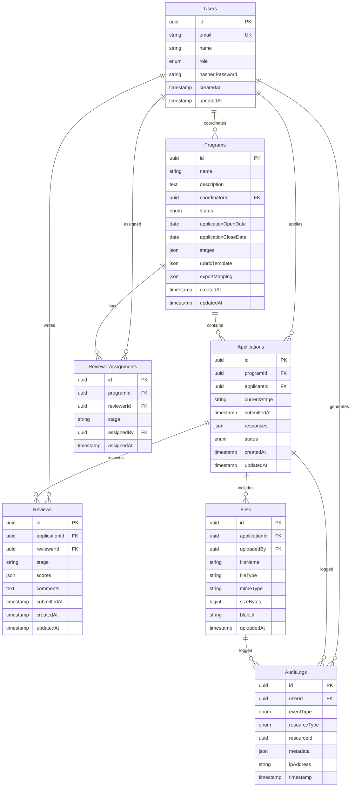

# CohortFlow Technical Architecture

**Version:** 1.0
**Last Updated:** February 12, 2026
**Tech Stack:** Next.js 14, TypeScript, tRPC, Drizzle ORM, PostgreSQL

---

## Table of Contents

1. [System Overview](#system-overview)
2. [Tech Stack Decisions](#tech-stack-decisions)
3. [Architecture Layers](#architecture-layers)
4. [Database Design](#database-design)
5. [API Design](#api-design)
6. [Authentication and Authorization](#authentication-and-authorization)
7. [File Handling](#file-handling)
8. [State Machine](#state-machine)
9. [Security Architecture](#security-architecture)
10. [Deployment Architecture](#deployment-architecture)

---

## System Overview

CohortFlow is a monorepo application using Turborepo for build orchestration. The system follows a three-tier architecture with clear separation of concerns.

### High-Level Architecture

```
┌─────────────────────────────────────────────────────────────────┐
│                         CLIENT LAYER                            │
│  ┌──────────────────────────────────────────────────────────┐  │
│  │  Next.js 14 App Router + React 18 + TypeScript          │  │
│  │  - Applicant Portal     - Coordinator Dashboard          │  │
│  │  - Reviewer Queue       - Pipeline Board                 │  │
│  └──────────────────────────────────────────────────────────┘  │
│                              ▼                                   │
│  ┌──────────────────────────────────────────────────────────┐  │
│  │  tRPC Client (@trpc/react-query)                         │  │
│  │  - Type-safe API calls  - Optimistic updates             │  │
│  └──────────────────────────────────────────────────────────┘  │
└─────────────────────────────────────────────────────────────────┘
                              ▼
┌─────────────────────────────────────────────────────────────────┐
│                         API LAYER                               │
│  ┌──────────────────────────────────────────────────────────┐  │
│  │  tRPC Server (@trpc/server)                              │  │
│  │  - Procedures (query, mutation)                          │  │
│  │  - Input validation (Zod schemas)                        │  │
│  │  - Authentication middleware                             │  │
│  │  - Authorization guards                                  │  │
│  └──────────────────────────────────────────────────────────┘  │
└─────────────────────────────────────────────────────────────────┘
                              ▼
┌─────────────────────────────────────────────────────────────────┐
│                       DATA LAYER                                │
│  ┌────────────────────────┐  ┌────────────────────────────┐   │
│  │  Drizzle ORM           │  │  Vercel Blob Storage       │   │
│  │  - Type-safe queries   │  │  - File uploads            │   │
│  │  - Migrations          │  │  - Time-limited URLs       │   │
│  │  - Transactions        │  │  - Access logging          │   │
│  └────────────────────────┘  └────────────────────────────┘   │
│              ▼                              ▼                   │
│  ┌────────────────────────┐  ┌────────────────────────────┐   │
│  │  Vercel Postgres       │  │  Vercel Blob               │   │
│  │  - Application data    │  │  - Resumes, transcripts    │   │
│  │  - User accounts       │  │  - References, documents   │   │
│  │  - Audit logs          │  │                            │   │
│  └────────────────────────┘  └────────────────────────────┘   │
└─────────────────────────────────────────────────────────────────┘
```

### System Components

**Frontend (apps/web):**
- Next.js 14 with App Router
- Server Components for initial rendering
- Client Components for interactivity
- Tailwind CSS + Shadcn/ui for styling

**API Server (apps/web/src/server):**
- tRPC routers for type-safe APIs
- NextAuth.js for authentication
- Middleware for authorization

**Database Layer (packages/db):**
- Drizzle ORM for queries
- PostgreSQL schema definitions
- Migration management

**File Storage:**
- Vercel Blob for uploaded files
- Time-limited URL generation
- Access logging integration

---

## Tech Stack Decisions

### Frontend Framework: Next.js 14

**Why Next.js:**
- **Server Components:** Reduce client bundle size, improve initial load
- **App Router:** File-based routing with layouts and nested routes
- **Server Actions:** Simplified form handling without API routes
- **Built-in Optimization:** Image optimization, font optimization, route prefetching
- **Vercel Integration:** Seamless deployment with zero config

**Alternatives Considered:**
- Vite + React: More configuration, no server-side rendering out of the box
- Remix: Less mature ecosystem, steeper learning curve

### TypeScript

**Why TypeScript:**
- **Type Safety:** Catch errors at compile time, not runtime
- **Developer Experience:** IntelliSense, refactoring, documentation
- **tRPC Integration:** End-to-end type safety from client to database
- **Maintainability:** Explicit contracts reduce bugs in collaborative development

### API Layer: tRPC

**Why tRPC:**
- **End-to-End Type Safety:** Single source of truth for API contracts
- **No Code Generation:** Types inferred automatically from procedures
- **DX:** Autocomplete for API calls, type errors in IDE
- **Lightweight:** No GraphQL complexity, no REST boilerplate
- **React Query Integration:** Caching, optimistic updates, background refetching

**Alternatives Considered:**
- REST: No type safety, manual API documentation, more boilerplate
- GraphQL: Overkill for MVP, complexity of resolvers and schema

### Database: PostgreSQL + Drizzle ORM

**Why PostgreSQL:**
- **Relational Model:** Natural fit for program/application/review relationships
- **ACID Guarantees:** Critical for audit logging and consistency
- **JSON Support:** Flexible storage for custom fields and rubric scores
- **Mature Ecosystem:** Well-understood, reliable, scalable

**Why Drizzle ORM:**
- **Type Safety:** Schema defined in TypeScript, types inferred
- **SQL-Like Syntax:** Minimal abstraction, easy to understand queries
- **Lightweight:** No runtime overhead compared to Prisma
- **Migration Control:** Explicit migrations, no magic

**Alternatives Considered:**
- Prisma: More magic, slower migrations, runtime overhead
- Raw SQL: No type safety, manual migration management

### Styling: Tailwind CSS + Shadcn/ui

**Why Tailwind CSS:**
- **Utility-First:** Rapid prototyping, no context switching
- **Consistent Design:** Design tokens baked into utility classes
- **Performance:** Purges unused CSS, small bundle size

**Why Shadcn/ui:**
- **Copy-Paste Components:** Own the code, no dependency on library updates
- **Accessible:** Built on Radix UI primitives
- **Customizable:** Tailwind classes, easy to modify
- **High Quality:** Production-ready components (Dialog, Select, Table, etc.)

### Authentication: NextAuth.js

**Why NextAuth.js:**
- **Next.js Integration:** Seamless setup with App Router
- **Session Management:** Built-in session handling with JWT or database sessions
- **Extensible:** Custom providers, callbacks for RBAC
- **Security:** Handles CSRF, session rotation, secure cookies

### File Storage: Vercel Blob

**Why Vercel Blob:**
- **Vercel Integration:** Zero config, deployed alongside app
- **Time-Limited URLs:** Built-in support for expiring file access
- **Global CDN:** Fast file delivery
- **Simple API:** Upload, download, delete - no S3 complexity

**Alternatives Considered:**
- AWS S3: More complex setup, requires IAM configuration
- Cloudflare R2: Good alternative, but less Vercel integration

### Monorepo: Turborepo

**Why Turborepo:**
- **Build Caching:** Faster CI/CD with cached build outputs
- **Parallel Execution:** Run tasks across packages concurrently
- **Dependency Awareness:** Only rebuild what changed
- **Vercel Native:** Built by Vercel, optimized for Vercel deployment

---

## Architecture Layers

### 1. Presentation Layer

**Location:** `apps/web/src/app`, `apps/web/src/components`

**Responsibilities:**
- Render UI components
- Handle user interactions
- Display data from API
- Form validation and submission

**Key Patterns:**
- **Server Components:** Default for static/initial rendering
- **Client Components:** For interactivity (forms, modals, drag-and-drop)
- **Layouts:** Shared navigation, headers, auth guards
- **Route Groups:** Organize by user role (coordinator, reviewer, applicant)

**Example Structure:**
```
apps/web/src/app/
├── (auth)/
│   ├── login/
│   └── register/
├── (coordinator)/
│   ├── dashboard/
│   ├── programs/
│   ├── pipeline/
│   └── audit-log/
├── (reviewer)/
│   └── queue/
└── (applicant)/
    ├── apply/
    └── status/
```

### 2. API Layer

**Location:** `apps/web/src/server`

**Responsibilities:**
- Define tRPC procedures (queries, mutations)
- Validate input with Zod schemas
- Enforce authentication and authorization
- Call database layer
- Handle errors and logging

**Key Patterns:**
- **Router Organization:** One router per resource (programs, applications, reviews)
- **Context:** Session, user, database client
- **Middleware:** Auth guards, role checks, audit logging
- **Error Handling:** tRPCError with codes (UNAUTHORIZED, BAD_REQUEST, etc.)

**Example Structure:**
```
apps/web/src/server/
├── api/
│   ├── routers/
│   │   ├── program.ts
│   │   ├── application.ts
│   │   ├── review.ts
│   │   ├── file.ts
│   │   └── audit.ts
│   ├── trpc.ts (createTRPCRouter, middleware)
│   └── root.ts (appRouter)
└── auth.ts (NextAuth config)
```

### 3. Business Logic Layer

**Location:** `apps/web/src/lib`, `packages/shared`

**Responsibilities:**
- State machine for stage transitions
- Rubric score aggregation
- Export mapping and CSV generation
- Email notification logic

**Key Patterns:**
- **State Machine:** Define allowed transitions, validation rules
- **Aggregation Functions:** Calculate average scores, rank applications
- **Template Rendering:** Generate email content from templates
- **CSV Builder:** Map fields to columns, handle escaping

### 4. Data Layer

**Location:** `packages/db`

**Responsibilities:**
- Define database schema (Drizzle)
- Provide query functions
- Manage migrations
- Seed data for development

**Key Patterns:**
- **Schema-First:** Define tables in `schema.ts`, types inferred
- **Query Builders:** Drizzle's chainable query API
- **Transactions:** Use `db.transaction()` for multi-step operations
- **Relations:** Define foreign keys, eager loading

**Example Structure:**
```
packages/db/
├── src/
│   ├── schema.ts (table definitions)
│   ├── index.ts (db client export)
│   └── seed.ts (synthetic data)
├── drizzle/ (generated migrations)
└── drizzle.config.ts
```

---

## Database Design

### Core Entities

**Users:**
- `id` (UUID, primary key)
- `email` (unique, indexed)
- `name`
- `role` (enum: APPLICANT, REVIEWER, COORDINATOR)
- `hashedPassword`
- `createdAt`, `updatedAt`

**Programs:**
- `id` (UUID, primary key)
- `name` (e.g., "Fall 2026 Volunteer Program")
- `description`
- `coordinatorId` (foreign key to Users)
- `status` (enum: DRAFT, OPEN, CLOSED)
- `applicationOpenDate`, `applicationCloseDate`
- `stages` (JSON array of stage definitions)
- `rubricTemplate` (JSON object)
- `exportMapping` (JSON object)
- `createdAt`, `updatedAt`

**Applications:**
- `id` (UUID, primary key)
- `programId` (foreign key to Programs)
- `applicantId` (foreign key to Users)
- `currentStage` (string, matches stages in Program)
- `submittedAt`
- `responses` (JSON object: { fieldId: value })
- `status` (enum: DRAFT, SUBMITTED, UNDER_REVIEW, ACCEPTED, REJECTED)
- `createdAt`, `updatedAt`

**Files:**
- `id` (UUID, primary key)
- `applicationId` (foreign key to Applications)
- `uploadedBy` (foreign key to Users)
- `fileName`
- `fileType` (e.g., "resume", "transcript")
- `mimeType`
- `sizeBytes`
- `blobUrl` (Vercel Blob URL)
- `uploadedAt`

**Reviews:**
- `id` (UUID, primary key)
- `applicationId` (foreign key to Applications)
- `reviewerId` (foreign key to Users)
- `stage` (string)
- `scores` (JSON object: { criterionId: score })
- `comments` (text)
- `submittedAt`
- `createdAt`, `updatedAt`

**ReviewerAssignments:**
- `id` (UUID, primary key)
- `programId` (foreign key to Programs)
- `reviewerId` (foreign key to Users)
- `stage` (string)
- `assignedBy` (foreign key to Users)
- `assignedAt`

**AuditLogs:**
- `id` (UUID, primary key)
- `userId` (foreign key to Users, nullable for system events)
- `eventType` (enum: FILE_UPLOAD, FILE_DOWNLOAD, STAGE_CHANGE, REVIEW_SUBMIT, EXPORT, etc.)
- `resourceType` (enum: APPLICATION, FILE, PROGRAM)
- `resourceId` (UUID)
- `metadata` (JSON object: event-specific details)
- `ipAddress` (string, optional)
- `timestamp`

### Schema Diagram (Mermaid)



### Indexes and Constraints

**Critical Indexes:**
- `users.email` (unique)
- `applications.programId, applications.currentStage` (pipeline queries)
- `applications.applicantId` (applicant dashboard)
- `reviews.applicationId` (fetch reviews for application)
- `reviewerAssignments.programId, reviewerAssignments.reviewerId` (reviewer queue)
- `auditLogs.resourceType, auditLogs.resourceId, auditLogs.timestamp` (audit queries)

**Foreign Key Constraints:**
- All foreign keys with `ON DELETE CASCADE` for Programs → Applications
- `ON DELETE SET NULL` for Users → AuditLogs (preserve logs if user deleted)

**Check Constraints:**
- `applications.status` in allowed values
- `programs.applicationOpenDate < applicationCloseDate`
- `files.sizeBytes > 0`

---

## API Design

### tRPC Router Structure

**Routers:**
- `program` - Program CRUD, configuration
- `application` - Application submission, queries
- `review` - Review submission, aggregation
- `file` - File upload, signed URL generation
- `audit` - Audit log queries
- `user` - User profile, role management

### Example: Program Router

```typescript
// apps/web/src/server/api/routers/program.ts

import { z } from 'zod';
import { createTRPCRouter, protectedProcedure } from '../trpc';
import { TRPCError } from '@trpc/server';

export const programRouter = createTRPCRouter({
  // Query: List programs (coordinator only)
  list: protectedProcedure
    .input(z.object({
      status: z.enum(['DRAFT', 'OPEN', 'CLOSED']).optional(),
    }))
    .query(async ({ ctx, input }) => {
      if (ctx.session.user.role !== 'COORDINATOR') {
        throw new TRPCError({ code: 'FORBIDDEN' });
      }

      return ctx.db.query.programs.findMany({
        where: (programs, { eq, and }) => and(
          eq(programs.coordinatorId, ctx.session.user.id),
          input.status ? eq(programs.status, input.status) : undefined,
        ),
        orderBy: (programs, { desc }) => [desc(programs.createdAt)],
      });
    }),

  // Query: Get single program
  byId: protectedProcedure
    .input(z.object({ id: z.string().uuid() }))
    .query(async ({ ctx, input }) => {
      const program = await ctx.db.query.programs.findFirst({
        where: (programs, { eq }) => eq(programs.id, input.id),
      });

      if (!program) {
        throw new TRPCError({ code: 'NOT_FOUND' });
      }

      // Check access
      const canAccess =
        ctx.session.user.role === 'COORDINATOR' && program.coordinatorId === ctx.session.user.id ||
        ctx.session.user.role === 'REVIEWER' // TODO: Check reviewer assignment

      if (!canAccess) {
        throw new TRPCError({ code: 'FORBIDDEN' });
      }

      return program;
    }),

  // Mutation: Create program
  create: protectedProcedure
    .input(z.object({
      name: z.string().min(1).max(255),
      description: z.string().optional(),
      applicationOpenDate: z.date(),
      applicationCloseDate: z.date(),
      stages: z.array(z.object({
        id: z.string(),
        name: z.string(),
        order: z.number(),
        automated: z.boolean(),
      })),
      rubricTemplate: z.object({
        criteria: z.array(z.object({
          id: z.string(),
          name: z.string(),
          description: z.string().optional(),
          maxScore: z.number(),
        })),
      }),
    }))
    .mutation(async ({ ctx, input }) => {
      if (ctx.session.user.role !== 'COORDINATOR') {
        throw new TRPCError({ code: 'FORBIDDEN' });
      }

      const [program] = await ctx.db.insert(programs).values({
        name: input.name,
        description: input.description,
        coordinatorId: ctx.session.user.id,
        applicationOpenDate: input.applicationOpenDate,
        applicationCloseDate: input.applicationCloseDate,
        stages: input.stages,
        rubricTemplate: input.rubricTemplate,
        status: 'DRAFT',
      }).returning();

      // Audit log
      await ctx.db.insert(auditLogs).values({
        userId: ctx.session.user.id,
        eventType: 'PROGRAM_CREATED',
        resourceType: 'PROGRAM',
        resourceId: program.id,
        metadata: { name: program.name },
        timestamp: new Date(),
      });

      return program;
    }),

  // Mutation: Update export mapping
  updateExportMapping: protectedProcedure
    .input(z.object({
      programId: z.string().uuid(),
      exportMapping: z.object({
        columns: z.array(z.object({
          name: z.string(),
          fieldPath: z.string(), // e.g., "responses.firstName"
        })),
      }),
    }))
    .mutation(async ({ ctx, input }) => {
      // Check ownership
      const program = await ctx.db.query.programs.findFirst({
        where: (programs, { eq }) => eq(programs.id, input.programId),
      });

      if (!program || program.coordinatorId !== ctx.session.user.id) {
        throw new TRPCError({ code: 'FORBIDDEN' });
      }

      await ctx.db.update(programs)
        .set({ exportMapping: input.exportMapping })
        .where(eq(programs.id, input.programId));

      return { success: true };
    }),
});
```

### Input Validation with Zod

All tRPC procedures use Zod schemas for input validation:

```typescript
// Shared schemas
const applicationResponseSchema = z.object({
  firstName: z.string().min(1).max(100),
  lastName: z.string().min(1).max(100),
  email: z.string().email(),
  phone: z.string().regex(/^\+?[1-9]\d{1,14}$/),
  customFields: z.record(z.string(), z.unknown()),
});

// Used in procedure
application.submit.input(z.object({
  programId: z.string().uuid(),
  responses: applicationResponseSchema,
  fileIds: z.array(z.string().uuid()),
}));
```

### Error Handling

**tRPC Error Codes:**
- `BAD_REQUEST` - Invalid input (failed Zod validation)
- `UNAUTHORIZED` - Not authenticated
- `FORBIDDEN` - Authenticated but not authorized
- `NOT_FOUND` - Resource doesn't exist
- `CONFLICT` - State conflict (e.g., application already submitted)
- `INTERNAL_SERVER_ERROR` - Unexpected errors

**Example:**
```typescript
if (!application) {
  throw new TRPCError({
    code: 'NOT_FOUND',
    message: 'Application not found',
  });
}
```

---

## Authentication and Authorization

### Authentication Flow (NextAuth.js)

**Session Strategy:** JWT (default)

**Configuration:**
```typescript
// apps/web/src/server/auth.ts

import NextAuth from 'next-auth';
import CredentialsProvider from 'next-auth/providers/credentials';
import { compare } from 'bcrypt';
import { db } from '@cohortflow/db';

export const authOptions = {
  providers: [
    CredentialsProvider({
      name: 'Credentials',
      credentials: {
        email: { label: 'Email', type: 'email' },
        password: { label: 'Password', type: 'password' },
      },
      async authorize(credentials) {
        if (!credentials?.email || !credentials?.password) {
          return null;
        }

        const user = await db.query.users.findFirst({
          where: (users, { eq }) => eq(users.email, credentials.email),
        });

        if (!user) {
          return null;
        }

        const isValid = await compare(credentials.password, user.hashedPassword);

        if (!isValid) {
          return null;
        }

        return {
          id: user.id,
          email: user.email,
          name: user.name,
          role: user.role,
        };
      },
    }),
  ],
  callbacks: {
    async jwt({ token, user }) {
      if (user) {
        token.id = user.id;
        token.role = user.role;
      }
      return token;
    },
    async session({ session, token }) {
      if (session.user) {
        session.user.id = token.id as string;
        session.user.role = token.role as string;
      }
      return session;
    },
  },
  pages: {
    signIn: '/login',
  },
};

export default NextAuth(authOptions);
```

### Authorization Middleware

**tRPC Context:**
```typescript
// apps/web/src/server/api/trpc.ts

import { getServerSession } from 'next-auth';
import { authOptions } from '../auth';

export const createTRPCContext = async (opts: { headers: Headers }) => {
  const session = await getServerSession(authOptions);

  return {
    session,
    db,
  };
};

// Protected procedure (requires auth)
export const protectedProcedure = t.procedure.use(async ({ ctx, next }) => {
  if (!ctx.session || !ctx.session.user) {
    throw new TRPCError({ code: 'UNAUTHORIZED' });
  }

  return next({
    ctx: {
      session: { ...ctx.session, user: ctx.session.user },
    },
  });
});

// Role-specific procedures
export const coordinatorProcedure = protectedProcedure.use(async ({ ctx, next }) => {
  if (ctx.session.user.role !== 'COORDINATOR') {
    throw new TRPCError({ code: 'FORBIDDEN' });
  }
  return next({ ctx });
});

export const reviewerProcedure = protectedProcedure.use(async ({ ctx, next }) => {
  if (ctx.session.user.role !== 'REVIEWER') {
    throw new TRPCError({ code: 'FORBIDDEN' });
  }
  return next({ ctx });
});
```

### Authorization Patterns

**Resource-Level Authorization:**
```typescript
// Check ownership before mutation
const application = await ctx.db.query.applications.findFirst({
  where: (applications, { eq }) => eq(applications.id, input.applicationId),
});

if (!application) {
  throw new TRPCError({ code: 'NOT_FOUND' });
}

// Applicant can only edit their own application
if (ctx.session.user.role === 'APPLICANT' && application.applicantId !== ctx.session.user.id) {
  throw new TRPCError({ code: 'FORBIDDEN' });
}

// Reviewer can only access assigned applications
if (ctx.session.user.role === 'REVIEWER') {
  const assignment = await ctx.db.query.reviewerAssignments.findFirst({
    where: (assignments, { eq, and }) => and(
      eq(assignments.reviewerId, ctx.session.user.id),
      eq(assignments.programId, application.programId),
    ),
  });

  if (!assignment) {
    throw new TRPCError({ code: 'FORBIDDEN' });
  }
}
```

---

## File Handling

### Upload Flow

**1. Client requests upload URL:**
```typescript
// tRPC procedure
file.getUploadUrl: protectedProcedure
  .input(z.object({
    fileName: z.string(),
    fileType: z.string(),
    applicationId: z.string().uuid(),
  }))
  .mutation(async ({ ctx, input }) => {
    // Validate file type
    const allowedTypes = ['application/pdf', 'image/jpeg', 'image/png', 'application/msword'];
    if (!allowedTypes.includes(input.fileType)) {
      throw new TRPCError({ code: 'BAD_REQUEST', message: 'Invalid file type' });
    }

    // Generate upload URL
    const { url, token } = await put(input.fileName, {
      access: 'public', // Will be restricted by signed URLs
      token: true, // Enable signed URL generation
    });

    // Create file record (status: PENDING)
    const [file] = await ctx.db.insert(files).values({
      applicationId: input.applicationId,
      uploadedBy: ctx.session.user.id,
      fileName: input.fileName,
      fileType: input.fileType,
      blobUrl: url,
      uploadedAt: new Date(),
    }).returning();

    // Audit log
    await ctx.db.insert(auditLogs).values({
      userId: ctx.session.user.id,
      eventType: 'FILE_UPLOAD',
      resourceType: 'FILE',
      resourceId: file.id,
      metadata: { fileName: input.fileName, sizeBytes: 0 },
      timestamp: new Date(),
    });

    return { uploadUrl: url, fileId: file.id, token };
  });
```

**2. Client uploads file to Blob:**
```typescript
// Client-side
const uploadFile = async (file: File, applicationId: string) => {
  // Get upload URL
  const { uploadUrl, fileId, token } = await trpc.file.getUploadUrl.mutate({
    fileName: file.name,
    fileType: file.type,
    applicationId,
  });

  // Upload to Blob
  await fetch(uploadUrl, {
    method: 'PUT',
    body: file,
    headers: {
      'Content-Type': file.type,
      'Authorization': `Bearer ${token}`,
    },
  });

  // Confirm upload
  await trpc.file.confirmUpload.mutate({ fileId });

  return fileId;
};
```

### Download Flow (Time-Limited URLs)

**Generate signed URL:**
```typescript
file.getDownloadUrl: protectedProcedure
  .input(z.object({ fileId: z.string().uuid() }))
  .query(async ({ ctx, input }) => {
    // Fetch file record
    const file = await ctx.db.query.files.findFirst({
      where: (files, { eq }) => eq(files.id, input.fileId),
      with: { application: true },
    });

    if (!file) {
      throw new TRPCError({ code: 'NOT_FOUND' });
    }

    // Check access
    const canAccess =
      file.application.applicantId === ctx.session.user.id ||
      ctx.session.user.role === 'COORDINATOR' ||
      (ctx.session.user.role === 'REVIEWER' && await isReviewerAssigned(ctx.session.user.id, file.application.programId));

    if (!canAccess) {
      throw new TRPCError({ code: 'FORBIDDEN' });
    }

    // Generate signed URL (1 hour expiry)
    const signedUrl = await getSignedUrl(file.blobUrl, {
      expiresIn: 3600, // 1 hour
    });

    // Audit log
    await ctx.db.insert(auditLogs).values({
      userId: ctx.session.user.id,
      eventType: 'FILE_DOWNLOAD',
      resourceType: 'FILE',
      resourceId: file.id,
      metadata: { fileName: file.fileName },
      timestamp: new Date(),
    });

    return { url: signedUrl, expiresAt: Date.now() + 3600000 };
  });
```

### File Validation

**Size Limits:** 10 MB per file
**Allowed Types:** PDF, JPEG, PNG, DOC, DOCX
**Virus Scanning:** Not in MVP (add post-launch with Cloudflare Stream)

---

## State Machine

### Application Stage Transitions

**State Diagram:**
```
         ┌────────┐
         │ DRAFT  │
         └───┬────┘
             │ submit()
             ▼
      ┌──────────────┐
      │  SUBMITTED   │
      └──────┬───────┘
             │ assign() (Coordinator)
             ▼
    ┌─────────────────┐
    │ UNDER_REVIEW    │◄───┐
    └────────┬────────┘    │
             │              │ request_changes()
             │ advance()    │ (Coordinator)
             ▼              │
     ┌──────────────┐      │
     │ IN_PROGRESS  ├──────┘
     └──────┬───────┘
            │ decision()
            ├─────────────┬──────────┐
            ▼             ▼          ▼
      ┌─────────┐  ┌──────────┐  ┌─────────┐
      │ACCEPTED │  │ WAITLIST │  │REJECTED │
      └─────────┘  └──────────┘  └─────────┘
```

**Transition Logic:**
```typescript
// apps/web/src/lib/state-machine.ts

export const APPLICATION_STATES = {
  DRAFT: 'DRAFT',
  SUBMITTED: 'SUBMITTED',
  UNDER_REVIEW: 'UNDER_REVIEW',
  IN_PROGRESS: 'IN_PROGRESS',
  ACCEPTED: 'ACCEPTED',
  WAITLIST: 'WAITLIST',
  REJECTED: 'REJECTED',
} as const;

export type ApplicationState = keyof typeof APPLICATION_STATES;

export const ALLOWED_TRANSITIONS: Record<ApplicationState, ApplicationState[]> = {
  DRAFT: ['SUBMITTED'],
  SUBMITTED: ['UNDER_REVIEW', 'REJECTED'],
  UNDER_REVIEW: ['IN_PROGRESS', 'REJECTED'],
  IN_PROGRESS: ['UNDER_REVIEW', 'ACCEPTED', 'WAITLIST', 'REJECTED'],
  ACCEPTED: [], // Terminal state
  WAITLIST: ['ACCEPTED', 'REJECTED'],
  REJECTED: [], // Terminal state
};

export function canTransition(from: ApplicationState, to: ApplicationState): boolean {
  return ALLOWED_TRANSITIONS[from].includes(to);
}

export function validateTransition(from: ApplicationState, to: ApplicationState): void {
  if (!canTransition(from, to)) {
    throw new Error(`Invalid transition from ${from} to ${to}`);
  }
}
```

**Usage in tRPC:**
```typescript
application.transition: coordinatorProcedure
  .input(z.object({
    applicationId: z.string().uuid(),
    toStage: z.enum(['SUBMITTED', 'UNDER_REVIEW', 'IN_PROGRESS', 'ACCEPTED', 'WAITLIST', 'REJECTED']),
    reason: z.string().optional(),
  }))
  .mutation(async ({ ctx, input }) => {
    const application = await ctx.db.query.applications.findFirst({
      where: (applications, { eq }) => eq(applications.id, input.applicationId),
    });

    if (!application) {
      throw new TRPCError({ code: 'NOT_FOUND' });
    }

    // Validate transition
    validateTransition(application.status, input.toStage);

    // Update status
    await ctx.db.update(applications)
      .set({ status: input.toStage, updatedAt: new Date() })
      .where(eq(applications.id, input.applicationId));

    // Audit log
    await ctx.db.insert(auditLogs).values({
      userId: ctx.session.user.id,
      eventType: 'STAGE_CHANGE',
      resourceType: 'APPLICATION',
      resourceId: input.applicationId,
      metadata: { from: application.status, to: input.toStage, reason: input.reason },
      timestamp: new Date(),
    });

    return { success: true };
  });
```

---

## Security Architecture

### Defense in Depth

**1. Input Validation:**
- Zod schemas for all API inputs
- SQL injection prevention via parameterized queries (Drizzle)
- File type and size validation

**2. Authentication:**
- bcrypt password hashing (12 rounds)
- Secure session cookies (httpOnly, secure, sameSite)
- JWT tokens for API authentication

**3. Authorization:**
- Role-based access control (RBAC)
- Resource-level ownership checks
- Least privilege enforcement

**4. File Security:**
- Time-limited signed URLs (1 hour expiry)
- Logged access events
- No direct blob URL exposure

**5. Audit Logging:**
- All critical events logged
- Tamper-evident (insert-only, no updates)
- Retained for 2+ years

**6. HTTPS Everywhere:**
- TLS 1.3 for all connections
- HSTS headers
- Secure cookie flags

### OWASP Top 10 Mitigation

**A01: Broken Access Control**
- Middleware checks on all protected routes
- Resource ownership validation

**A02: Cryptographic Failures**
- bcrypt for passwords
- Secure random UUIDs
- No sensitive data in logs

**A03: Injection**
- Drizzle ORM (parameterized queries)
- Zod validation on all inputs

**A04: Insecure Design**
- Principle of least privilege
- State machine for valid transitions

**A05: Security Misconfiguration**
- Environment variables for secrets
- No debug mode in production
- Security headers (CSP, X-Frame-Options)

**A07: Identification and Authentication Failures**
- NextAuth.js best practices
- Session rotation
- Rate limiting on login (future)

**A08: Software and Data Integrity Failures**
- Audit logs for data changes
- Signed URLs for file access

**A10: Server-Side Request Forgery**
- No user-controlled URLs
- File uploads to trusted Vercel Blob only

---

## Deployment Architecture

### Vercel Deployment

**Infrastructure:**
- **Compute:** Vercel Serverless Functions (Node.js 18)
- **Database:** Vercel Postgres (managed PostgreSQL)
- **Storage:** Vercel Blob (global CDN)
- **CDN:** Vercel Edge Network (300+ locations)

**Architecture Diagram:**
```
┌─────────────────────────────────────────────────────────────┐
│                     Vercel Edge Network                     │
│  ┌───────────────────────────────────────────────────────┐  │
│  │  Static Assets (/_next/static/*)                      │  │
│  │  - JavaScript bundles, CSS, images                    │  │
│  │  - Cached at edge locations                           │  │
│  └───────────────────────────────────────────────────────┘  │
└────────────────────────────┬────────────────────────────────┘
                             │
                             ▼
┌─────────────────────────────────────────────────────────────┐
│               Vercel Serverless Functions                   │
│  ┌───────────────────────────────────────────────────────┐  │
│  │  Next.js Server (SSR + API Routes)                    │  │
│  │  - Dynamic page rendering                             │  │
│  │  - tRPC API handlers                                  │  │
│  │  - NextAuth.js session management                     │  │
│  └───────────────┬───────────────────────┬───────────────┘  │
└──────────────────┼───────────────────────┼──────────────────┘
                   │                       │
       ┌───────────▼──────────┐   ┌────────▼────────┐
       │  Vercel Postgres     │   │  Vercel Blob    │
       │  - Application data  │   │  - File uploads │
       │  - User accounts     │   │  - CDN delivery │
       │  - Audit logs        │   │                 │
       └──────────────────────┘   └─────────────────┘
```

### Environment Variables

**Required for Production:**
```env
# Database
DATABASE_URL=postgres://...

# NextAuth
NEXTAUTH_SECRET=<random-32-char-string>
NEXTAUTH_URL=https://cohortflow.vercel.app

# Vercel Blob
BLOB_READ_WRITE_TOKEN=<vercel-blob-token>

# Optional
NODE_ENV=production
```

### CI/CD Pipeline

**Triggered on:**
- Push to `main` branch → Deploy to production
- Push to feature branches → Deploy to preview

**Deployment Steps:**
1. Install dependencies (`pnpm install`)
2. Type check (`turbo run type-check`)
3. Lint (`turbo run lint`)
4. Build (`turbo run build`)
5. Deploy to Vercel
6. Run database migrations (if schema changed)

**Preview Deployments:**
- Each PR gets a unique preview URL
- Preview uses separate Vercel Postgres instance
- Auto-deleted after PR merge

### Monitoring and Logging

**Vercel Analytics:**
- Page views, Core Web Vitals
- Serverless function execution time
- Error rates

**Application Logging:**
- Console logs captured by Vercel
- Searchable in Vercel dashboard
- Retention: 7 days (free tier)

**Database Monitoring:**
- Connection pool usage
- Query performance (slow query log)
- Storage usage

**Alerting (Post-MVP):**
- Uptime monitoring (e.g., Better Uptime)
- Error tracking (e.g., Sentry)
- Slack notifications

### Scaling Considerations

**Current Limits (Vercel Pro):**
- 1000 serverless function invocations/hour
- 100 GB bandwidth/month
- 10 GB Vercel Postgres storage

**Scaling Plan:**
- Vercel Enterprise for higher limits
- Database read replicas for analytics queries
- Redis cache for session storage (future)
- Background job queue for exports (future)

---

## Development Workflow

### Local Development

**Setup:**
```bash
# Install dependencies
pnpm install

# Start local Postgres (Docker)
docker run -d --name cohortflow-db \
  -e POSTGRES_USER=postgres \
  -e POSTGRES_PASSWORD=postgres \
  -e POSTGRES_DB=cohortflow \
  -p 5432:5432 postgres:14

# Push schema to database
pnpm db:push

# Seed data
pnpm db:seed

# Start dev server
pnpm dev
```

**Hot Reloading:**
- Next.js Fast Refresh for React components
- tRPC client auto-updates on procedure changes
- Drizzle schema changes require `db:push`

### Testing Strategy

**Unit Tests (Future):**
- Vitest for business logic functions
- Test state machine transitions, CSV generation, score aggregation

**Integration Tests (Future):**
- Playwright for E2E flows
- Test full application submission → review → export flow

**Type Checking:**
- Run `turbo run type-check` before commit
- CI fails on type errors

---

## Future Enhancements

### Performance Optimizations

- **React Server Components:** Move more components to RSC for smaller bundles
- **Incremental Static Regeneration:** Cache program pages with `revalidate`
- **Database Indexing:** Add composite indexes for complex queries
- **Edge Functions:** Move auth checks to edge for faster response

### Feature Additions

- **Real-Time Updates:** WebSocket for live pipeline board updates
- **Background Jobs:** Queue for email sending, exports (BullMQ + Redis)
- **Advanced Analytics:** Coordinator dashboard with funnel metrics
- **SSO Integration:** SAML/OAuth for hospital identity providers

### Infrastructure

- **Multi-Tenancy:** Separate schemas per hospital organization
- **Data Residency:** Regional deployments for EU/APAC compliance
- **Backup Strategy:** Automated daily backups with point-in-time recovery
- **Disaster Recovery:** Cross-region replication

---

## References

- [Next.js Documentation](https://nextjs.org/docs)
- [tRPC Documentation](https://trpc.io/docs)
- [Drizzle ORM Documentation](https://orm.drizzle.team/docs/overview)
- [NextAuth.js Documentation](https://next-auth.js.org/getting-started/introduction)
- [Vercel Documentation](https://vercel.com/docs)
- [PRODUCT_SPEC.md](./PRODUCT_SPEC.md) - Product requirements
- [API.md](./API.md) - API reference
- [DATABASE.md](./DATABASE.md) - Database schema
- [DEPLOYMENT.md](./DEPLOYMENT.md) - Deployment guide

---

**Document Maintained By:** MAIA Biotech Spring 2026 Team
**Last Review:** February 12, 2026
